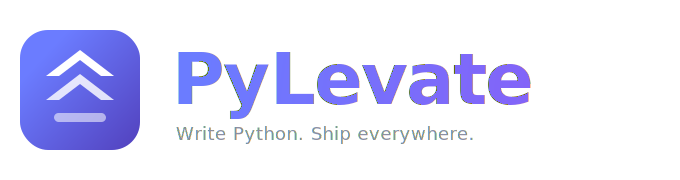

<div align="center">



**Write Python. Ship web apps and games. Deploy to iOS and Android.**

[](https://www.python.org)
[](https://github.com/KellerKev/pylevate/actions/workflows/ci.yml)
[](#development)
[](#how-the-compiler-works)
[](LICENSE)

</div>

---

## What is PyLevate

PyLevate is a Python-syntax full-stack framework that compiles to Preact (for web apps) and Phaser (for 2D games). You write standard Python -- classes, dicts, decorators, pygame calls -- and the compiler transforms it into optimized JavaScript bundles. There is **no Python interpreter at runtime**; everything compiles away at build time. The same codebase deploys to the browser, iOS, and Android via Capacitor.

```python
from pylevate import Component, h, state, mount

class Counter(Component):
    count = state(0)

    def increment(self):
        self.count += 1

    template = {
        h.button(onClick={'self.increment'}): 'Clicked [[self.count]] times',
    }

mount(Counter, '#app')
```

That compiles to a ~12KB gzipped Preact bundle -- no virtual DOM diffing of Python, no WASM, no runtime interpreter. Just JavaScript.

## Why PyLevate

- **One language, three targets.** The same Python skills build reactive web UIs (`app`), 2D games (`game`), or both at once (`hybrid`).
- **Real Python syntax.** Classes, dicts, decorators, comprehensions, `pygame` calls -- not a Python-flavored DSL. Your editor, type checker, and muscle memory just work.
- **Compiles away entirely.** Ships idiomatic Preact + Phaser JS. No interpreter tax at runtime; bundles start around ~12KB gzipped.
- **Reactive by default.** `state()` and `store()` build on `@preact/signals` for fine-grained updates without a virtual-DOM re-render.
- **pygame in the browser.** Write `pygame`-style game loops; they hoist into Phaser's render loop automatically.
- **Mobile from day one.** `--mobile` wires up Capacitor so the same code base builds for iOS and Android.
- **Fast dev loop.** Live reload with store-state restore and a compile-error overlay, scoped CSS, and a zero-config playground you can run with a single command.

---

## Table of Contents

- [Quickstart](#quickstart)
- [Three Modes](#three-modes)
- [App Mode](#app-mode)
  - [Components](#components)
  - [Props](#props)
  - [Signals and Stores](#signals-and-stores)
  - [Template Syntax](#template-syntax)
  - [Expression Tiers](#expression-tiers)
  - [Scoped CSS](#scoped-css)
  - [Routing](#routing)
- [Game Mode](#game-mode)
  - [pygame API](#pygame-api)
  - [Sprite and Group](#sprite-and-group)
  - [Collision Detection](#collision-detection)
  - [Input](#input)
  - [Sound and Font](#sound-and-font)
  - [Physics](#physics)
  - [How Game Code Compiles](#how-game-code-compiles)
- [Hybrid Mode](#hybrid-mode)
- [Mobile](#mobile)
- [CLI Reference](#cli-reference)
- [How the Compiler Works](#how-the-compiler-works)
- [Project Structure](#project-structure)
- [Configuration](#configuration)
- [Development](#development)

---

## Quickstart

Prerequisites: Python 3.10+, Node.js 20+, [Pixi](https://pixi.sh) for environment management.

**Fastest taste -- no scaffolding:** spin up the live playground and write PyLevate in your browser.

```bash
pixi install
pixi run python -m pylevate.cli playground   # → http://localhost:4000
```

**Start a real project:**

```bash
# Install and scaffold
pixi install
pixi run init my-app

# Develop with HMR
cd my-app
pixi run dev

# Production build
pixi run build
```

The `init` command accepts a template flag: `--template app` (default), `--template game`, `--template hybrid`, or `--template dashboard`.

Add `--mobile` to pre-configure Capacitor for iOS/Android builds:

```bash
pixi run init my-app --template app --mobile
```

---

## Three Modes

PyLevate supports three project modes, set in `pylevate.config.py`:

| Mode | Compiler Path | Runtime | Use Case |
|------|---------------|---------|----------|
| `app` | Dict walker + CSS scoper | Preact + @preact/signals | Web apps, dashboards, tools |
| `game` | Loop hoister + asset hoister | Phaser + pygame shim | 2D games |
| `hybrid` | Both paths | Preact + Phaser + event bridge | Game with DOM UI overlay |

### App Mode

```python
from pylevate import Component, h, state, css, mount

class App(Component):
    count = state(0)

    style = css("""
        .counter { display: flex; gap: 1rem; align-items: center; }
        .btn { background: #5c6bc0; color: white; border: none; padding: 0.5rem 1.5rem; }
    """)

    def increment(self):
        self.count += 1

    template = {
        h.div(Class='counter'): {
            h.button(Class='btn', onClick={'self.increment'}): '+1',
            h.span(): '[[self.count]]',
        }
    }

mount(App, '#app')
```

### Game Mode

```python
import pylevate.game as pg

pg.init()
screen = pg.display.set_mode((800, 600))

class Player(pg.Sprite):
    def __init__(self):
        super().__init__()
        self.image = pg.image.load('assets/player.png')
        self.rect = self.image.get_rect()
        self.rect.center = (400, 500)

    def update(self):
        keys = pg.key.get_pressed()
        if keys[pg.K_LEFT]:
            self.rect.x -= 5
        if keys[pg.K_RIGHT]:
            self.rect.x += 5

all_sprites = pg.sprite.Group()
player = Player()
all_sprites.add(player)

clock = pg.time.Clock()
running = True
while running:
    for event in pg.event.get():
        if event.type == pg.QUIT:
            running = False
    all_sprites.update()
    screen.fill((0, 0, 30))
    all_sprites.draw(screen)
    pg.display.flip()
    clock.tick(60)
```

This same file runs locally with real pygame (`pip install pygame && python main.py`) and compiles to Phaser for web/mobile.

### Hybrid Mode

```python
# main.py -- Preact HUD overlay
from pylevate import Component, h, state, css, mount
from pylevate.events import game_events

class HUD(Component):
    score = state(0)

    def on_mount(self):
        game_events.on('score_change', self._on_score)

    def _on_score(self, val):
        self.score = val

    template = {
        h.div(Class='hud'): {
            h.span(): 'Score: [[self.score]]',
        }
    }

mount(HUD, '#ui-layer')
```

```python
# game.py -- Phaser game underneath
import pylevate.game as pg
from pylevate.events import game_events

# ... sprites, setup ...
while running:
    collected = pg.sprite.spritecollide(player, coins, True)
    if len(collected) > 0:
        score += len(collected) * 100
        game_events.emit('score_change', score)
    # ...
```

---

## App Mode

### Components

Every UI unit is a class extending `Component`. The template is a Python dict that compiles to Preact `h()` calls at build time. No Python executes at runtime.

```python
from pylevate import Component, SlotsEnum, state, css, h

class Card(Component):

    class S(SlotsEnum):
        default = ()
        footer  = ()

    def __init__(self, title: str, elevated: bool = False, **kw):
        super().__init__(title=title, elevated=elevated, **kw)

    expanded = state(False)

    style = css("""
        .card { border-radius: 8px; padding: 1.25rem; background: var(--surface); }
        .card.elevated { box-shadow: 0 4px 16px rgba(0,0,0,0.12); }
        .card-header { display: flex; justify-content: space-between; cursor: pointer; }
        .card-body { margin-top: 0.75rem; }
        .card-body.hidden { display: none; }
    """)

    def toggle(self):
        self.expanded = not self.expanded

    def get_context(self, props: dict) -> dict:
        props['chevron']    = '...' if self.expanded else '...'
        props['body_class'] = 'card-body' if self.expanded else 'card-body hidden'
        return props

    template = {
        h.div(Class='card'): {
            h.div(Class='card-header', onClick={'self.toggle'}): {
                h.h3(): '[[title]]',
                h.span(): '[[chevron]]',
            },
            h.div(Class='[[body_class]]'): {
                S.default.slot(): '',
                h.div(Class='card-footer'): {
                    S.footer.slot(): '',
                }
            }
        }
    }
```

**Lifecycle hooks:**

| Hook | When |
|------|------|
| `on_mount()` | After component mounts to DOM |
| `on_unmount()` | Before component unmounts |
| `on_update(prev_props)` | After component updates |
| `get_context(props)` | Before every render -- returns extended props with derived values |

`get_context` compiles to a pre-render method. Use it to compute derived values that the template needs, keeping the template dict free of logic.

`template_factory(cls)` is a static method for recursive components (tree views, nested menus). It receives the class as an argument so the template can reference itself.

### Props

**`__init__` style** (preferred -- gives IDE autocomplete and docstrings):

```python
def __init__(self, label: str, variant: str = 'primary', on_click=None, **kw):
    """Button component.
    Args:
        label:   Button text
        variant: primary | ghost | danger
    """
    super().__init__(label=label, variant=variant, on_click=on_click, **kw)
```

**`props` dict style** (for simple components):

```python
class Badge(Component):
    props = {'text': 'New', 'color': 'brand'}
```

### Signals and Stores

Reactive state uses `@preact/signals` under the hood. `state(x)` compiles to `signal(x)`, with reads and writes going through `.value` automatically.

**Component-level state:**

```python
class Counter(Component):
    count = state(0)          # compiles to: this.count = signal(0)

    def increment(self):
        self.count += 1       # compiles to: this.count.value += 1
```

**Cross-component stores:**

```python
from pylevate import Store, computed, action, effect
from pylevate.signals import signal

class CartStore(Store):
    items    = signal([])
    currency = signal('EUR')

    @computed
    def total(self):
        return sum(i['price'] * i['qty'] for i in self.items.value)

    @action
    def add_item(self, product, qty=1):
        existing = next(
            (i for i in self.items.value if i['id'] == product['id']), None
        )
        if existing:
            existing['qty'] += qty
            self.items.value = [*self.items.value]
        else:
            self.items.value = [*self.items.value, {**product, 'qty': qty}]

    @effect
    def persist(self):
        v"localStorage.setItem('cart', JSON.stringify(this.items.value))"

cart = CartStore()
```

The `v"..."` syntax is a verbatim JS literal -- the escape hatch for browser APIs that have no Python equivalent. For multi-line JS, use the triple-quoted form:

```python
@effect
def persist(self):
    v"""
    const payload = JSON.stringify(this.items.value);
    localStorage.setItem('cart', payload);
    """
```

Backslashes inside triple-quoted verbatim JS are preserved as written (regexes like `/\d+/` survive intact).

### Calling JavaScript APIs from Python

Keyword arguments always compile to a **single trailing object literal**:

```python
Card(title='Hello', elevated=True)   # → h(Card, {title: 'Hello', elevated: true})
fetch('/api', method='POST')         # → fetch('/api', {method: 'POST'})
```

That convention is right for PyLevate components and stores, and happens to be right for `fetch` -- but most native JS APIs take positional arguments. The compiler emits a **warning** when kwargs are passed to a call rooted at a known JS global (`document`, `window`, `Math`, `setTimeout`, ...). Where the object form isn't what the API expects, use positional arguments, pass a dict literal explicitly, or drop to a `v"..."` verbatim literal.

### Template Syntax

Templates are Python dicts. Keys are tag instances created via `h.tagname(...)`, values are children (strings, dicts for nesting, or `None`).

| Pattern | Compiles To |
|---------|-------------|
| `h.div(Class='foo'): {...}` | `h('div', {class: 'foo-a3f9b2'}, ...)` |
| `h.div(Class={'expr'}): ...` | `h('div', {class: expr}, ...)` |
| `h.div(Class=b'lit'): ...` | `h('div', {class: 'lit'}, ...)` (unprocessed) |
| `ComponentName(...): {...}` | `h(ComponentName, {...}, ...)` |
| `h.Template(For='x in xs'): {...}` | `xs.map(x => h(...))` |
| `h.Template(If='expr'): {...}` | `expr ? h(...) : null` |
| `h.Template(If=...) / Elif / Else` | Chained ternary |
| `h.Template(Is='expr'): {...}` | `h(resolveComponent(expr), ...)` |
| `S.name.slot(): content` | Slot definition |
| `Comp.S.name(): {...}` | Slot fill |
| `'[[expr]]'` in text | `` `${expr}` `` (template literal) |

`h.Template` is a meta-tag that applies control flow but emits no DOM element.

`[[expr]]` uses double-square-bracket delimiters to avoid collision with Vue, Mustache, and Handlebars if mixing template systems.

**Full example with iteration and conditionals:**

```python
template = {
    h.div(Class='product-list'): {

        h.input(
            type='text',
            value={'self.filter_text'},
            onInput={'e => self.filter_text = e.target.value'}
        ): None,

        h.Template(If={'len(filtered) == 0'}): {
            h.p(Class='empty'): 'No results.'
        },

        h.div(Class='grid'): {
            h.Template(For='product in filtered'): {
                h.div(Class='card', key={'product["id"]'}): {
                    h.h3(): '[[product["name"]]]',
                    h.p(): '[[currency]] [[product["price"]]]',
                }
            }
        }
    }
}
```

**Semantic custom tags** wrap CSS framework classes:

```python
from pylevate import Tag

class NavItem(Tag):
    tag_name    = 'a'
    ident_class = 'navbar-item'

template = {
    NavItem(href='/home'): 'Home',
    NavItem(href='/about', Tag='div'): 'About',
}
```

**Named slots:**

```python
class Modal(Component):
    class S(SlotsEnum):
        default = ()
        header  = ()
        actions = ()

    template = {
        h.div(Class='modal'): {
            h.div(Class='modal-header'): { S.header.slot(): {h.h2(): '[[title]]'} },
            h.div(Class='modal-body'):   { S.default.slot(): '' },
            h.div(Class='modal-actions'):{ S.actions.slot(): {h.button(onClick={'on_close'}): 'Close'} }
        }
    }

# Filling slots when using the component:
template = {
    Modal(title='Confirm', on_close={'handle_close'}): {
        Modal.S.default(): {h.p(): 'Are you sure?'},
        Modal.S.actions(): {
            h.button(Class='btn-danger', onClick={'confirm'}): 'Delete',
            h.button(onClick={'handle_close'}): 'Cancel',
        }
    }
}
```

### Expression Tiers

Template attribute values come in three tiers:

```python
# Tier 1 -- static string: no processing, passed as-is
h.div(Class='card'): 'Hello'

# Tier 2 -- bytes literal: bypass all processing, literal output
h.meta(charset=b'utf-8'): ''

# Tier 3 -- set wrapping a string: evaluated as a JS expression
h.button(disabled={'not allow_submit'}): 'Submit'
# True  -> <button disabled>
# False -> <button>
```

Tier 3 (set syntax) is the primary way to bind dynamic values. The string inside the set is emitted as a JavaScript expression.

### Scoped CSS

`style = css(...)` inside a component is extracted at compile time. Class names receive a SHA1-based suffix derived from the file path:

```
.card  ->  .card-a3f9b2    (first 6 characters of SHA1 of the file path)
```

The suffix is deterministic -- the same file path always produces the same hash. This means `.card` in `button.py` can never collide with `.card` in `card.py`. Builds are reproducible.

Global styles go in `styles/global.css` using CSS custom properties:

```css
:root {
    --color-brand:   #5c6bc0;
    --color-danger:  #e53935;
    --color-surface: #ffffff;
    --radius-md:     6px;
}
```

Implementation: `pylevate/compiler/css_scoper.py`

### Routing

```python
from pylevate import App, Router
from pages.home import Home
from pages.dashboard import Dashboard
from pages.profile import Profile

app = App(
    router=Router([
        ('/',            Home),
        ('/dashboard',   Dashboard),
        ('/profile/:id', Profile),
    ]),
    theme='styles/global.css',
)
app.mount('#app')
```

Page components use the `@page` decorator:

```python
from pylevate import Component, h, page

@page(title='Profile', route='/profile/:id')
class Profile(Component):

    def get_context(self, props):
        props['display_name'] = props['user']['name'] if props.get('user') else 'Loading...'
        return props

    template = {
        h.div(Class='profile'): {
            h.h1(): '[[display_name]]',
        }
    }
```

Routing compiles to `preact-router` under the hood. Users never import from `preact-router` directly.

- Route params (`:id`) arrive as props on the page component -- read them in `get_context(props)`.
- `@page(title=...)` sets `document.title` when the route becomes active.
- Plain `h.a(href='/dashboard')` anchors navigate client-side; no special Link component needed.
- The dev server serves `index.html` for extensionless paths, so deep links like `/profile/42` work out of the box. Configure equivalent history-API fallback on your production host.

The `dashboard` template (`pylevate init my-app --template dashboard`) is a working routed app: pages, shared nav component, route params, and a cross-page store.

---

## Game Mode

### pygame API

Game mode uses a pygame-compatible Python API. `import pylevate.game as pg` mirrors pygame's namespace. The same code runs locally with real pygame for rapid iteration, then compiles to Phaser for web and mobile deployment.

```python
import pylevate.game as pg

pg.init()
screen = pg.display.set_mode((800, 600))
pg.display.set_caption('My Game')

clock = pg.time.Clock()
running = True

while running:
    for event in pg.event.get():
        if event.type == pg.QUIT:
            running = False

    screen.fill((0, 0, 30))
    pg.display.flip()
    clock.tick(60)
```

**pygame to Phaser translation:**

| pygame | Phaser Equivalent |
|--------|-------------------|
| `pg.init()` + `set_mode()` | `new Phaser.Game(config)` |
| `pg.image.load('f.png')` | `this.load.image(key, url)` in `preload()` |
| `pg.mixer.Sound('f.wav')` | `this.load.audio(key, url)` in `preload()` |
| `pg.sprite.Sprite` | `Phaser.GameObjects.Sprite` |
| `pg.sprite.Group()` | `this.add.group()` |
| `pg.sprite.spritecollide(s,g,kill)` | `this.physics.add.overlap(s, g, cb)` |
| `pg.key.get_pressed()` | `this.input.keyboard.addKeys(...)` |
| `screen.fill((r,g,b))` | `this.cameras.main.setBackgroundColor(hex)` |
| `pg.display.flip()` | No-op (Phaser renders automatically) |
| `clock.tick(60)` | `fps: { target: 60 }` in Phaser config |
| `pg.font.Font(None, 36)` | `this.add.text(x, y, '', style)` |
| `sprite.kill()` | Destroy Phaser object + remove from all groups |

### Sprite and Group

```python
import pylevate.game as pg

class Player(pg.Sprite):
    def __init__(self):
        super().__init__()
        self.image = pg.image.load('assets/player.png')
        self.rect = self.image.get_rect()
        self.rect.center = (400, 500)
        self.speed = 5

    def update(self):
        keys = pg.key.get_pressed()
        if keys[pg.K_LEFT]:
            self.rect.x -= self.speed
        if keys[pg.K_RIGHT]:
            self.rect.x += self.speed

    def shoot(self):
        bullet = Bullet(self.rect.centerx, self.rect.top)
        all_sprites.add(bullet)
        bullets.add(bullet)

all_sprites = pg.sprite.Group()
bullets     = pg.sprite.Group()
enemies     = pg.sprite.Group()
```

`Sprite.kill()` destroys the Phaser game object and removes the sprite from all groups.

### Collision Detection

```python
# Sprite vs Group -- returns list of colliding sprites
hits = pg.sprite.spritecollide(player, enemies, False)
for hit in hits:
    player.take_damage(10)

# With kill -- True removes colliders from the group
hits = pg.sprite.spritecollide(player, coins, True)
score += len(hits) * 100

# Group vs Group -- returns dict {sprite_in_g1: [sprites_in_g2]}
collisions = pg.sprite.groupcollide(enemies, bullets, True, True)
for enemy, bullet_list in collisions.items():
    score += 10 * len(bullet_list)
```

### Input

```python
# Continuous hold (checked every frame)
keys = pg.key.get_pressed()
if keys[pg.K_LEFT]:
    self.rect.x -= self.speed

# Event-based (fire once on press)
for event in pg.event.get():
    if event.type == pg.KEYDOWN:
        if event.key == pg.K_SPACE:
            player.shoot()

# Available key constants:
# pg.K_LEFT, pg.K_RIGHT, pg.K_UP, pg.K_DOWN
# pg.K_SPACE, pg.K_RETURN, pg.K_ESCAPE
```

### Sound and Font

```python
# Sound effects
shot_sound = pg.mixer.Sound('assets/shoot.wav')
shot_sound.play()

# Music
pg.mixer.music.load('assets/theme.mp3')
pg.mixer.music.play(loops=-1)
pg.mixer.music.set_volume(0.5)

# Text rendering
font = pg.font.Font(None, 36)
text_surface = font.render(f'Score: {score}', True, (255, 255, 255))
screen.blit(text_surface, (10, 10))
```

Font objects compile to Phaser Text objects that update in place. `blit` on a text surface compiles to `.setText()` rather than creating a new object each frame.

### Physics

For games needing gravity and physics bodies, `pg.physics` wraps Phaser Arcade Physics:

```python
class Player(pg.Sprite):
    def __init__(self):
        super().__init__()
        self.image = pg.image.load('assets/player.png')
        self.rect = self.image.get_rect()
        self.rect.center = (100, 400)
        self.physics = pg.physics.body(self)
        self.physics.gravity_y = 400
        self.physics.bounce = 0.1

    def update(self):
        keys = pg.key.get_pressed()
        if keys[pg.K_LEFT]:
            self.physics.vel_x = -200
        elif keys[pg.K_RIGHT]:
            self.physics.vel_x = 200
        else:
            self.physics.vel_x = 0
        if keys[pg.K_UP] and self.physics.on_ground:
            self.physics.vel_y = -500
```

### How Game Code Compiles

The compiler performs three structural transforms on game files (see `pylevate/compiler/loop_hoister.py`):

**1. Asset hoisting** -- All `pg.image.load()`, `pg.mixer.Sound()`, and `pg.mixer.music.load()` calls are collected into Phaser's `preload()`:

```javascript
function _preload(scene) {
    scene.load.image('player', 'assets/player.png');
    scene.load.image('enemy', 'assets/enemy.png');
    scene.load.audio('shoot', 'assets/shoot.wav');
}
```

**2. Setup hoisting** -- Sprite instantiation, group creation, and variable initialization before the main loop are emitted into `create()`:

```javascript
function _create(scene) {
    let all_sprites = pg.sprite.Group();
    let player = new Player();
    all_sprites.add(player);
    // ...
}
```

**3. Loop body to update** -- The `while running:` body becomes `update()`. Explicit no-ops (`display.flip()`, `group.draw()`, `screen.fill()`) are elided:

```javascript
function _update(scene) {
    all_sprites.update();
    let hits = pg.sprite.groupcollide(bullets, enemies, true, true);
    // ...
}
```

The final output calls `createGame()` with width, height, fps, background color, and the three functions.

---

## Hybrid Mode

Hybrid mode runs both compiler paths. The game renders in a Phaser canvas; Preact components overlay the canvas for HUD, menus, and other DOM UI.

The `game_events` bridge (`pylevate.events`) connects the two worlds:

```python
# From game code:
from pylevate.events import game_events
game_events.emit('score_change', score)
game_events.emit('life_lost')

# From UI components:
from pylevate.events import game_events

class HUD(Component):
    score = state(0)
    lives = state(3)

    def on_mount(self):
        game_events.on('score_change', self._on_score)
        game_events.on('life_lost', self._on_life_lost)

    def _on_score(self, val):
        self.score = val

    def _on_life_lost(self):
        self.lives = self.lives - 1
```

`game_events` is a singleton `EventBus` (implemented in `js/pylevate-events.js`) shared across all modules. It supports `on()`, `once()`, `emit()`, and `off()`.

In hybrid mode, `pylevate.config.py` uses `mode = 'hybrid'`, and the project has separate entry points for UI (`main.py`) and game (`game.py`). Both are bundled as entry points by esbuild.

---

## Mobile

PyLevate uses Capacitor 5 to wrap the compiled web output for iOS and Android.

### Setup

```bash
# Initialize with mobile support
pylevate init my-app --mobile

# Or add mobile to an existing project
cd my-app
pylevate mobile init ios
pylevate mobile init android
pylevate mobile init both
```

### Build and deploy

```bash
pylevate mobile ios        # Build, sync, open Xcode
pylevate mobile android    # Build, sync, open Android Studio
pylevate mobile run ios    # Build, sync, run on device/simulator
```

### Native bridge

Import native capabilities from `pylevate.native`:

```python
from pylevate.native import Camera, Geolocation, Haptics, Storage, Share

class ProfileEditor(Component):

    async def pick_avatar(self):
        photo = await Camera.get_photo(quality=90, result_type='uri')
        self.avatar_url = photo.web_path
        await Haptics.impact(style='medium')

    async def save_location(self):
        pos = await Geolocation.get_current_position()
        await Storage.set(key='last_pos', value={
            'lat': pos.coords.latitude,
            'lng': pos.coords.longitude,
        })
```

| Python Import | Capacitor Plugin |
|---------------|------------------|
| `Camera` | `@capacitor/camera` |
| `Geolocation` | `@capacitor/geolocation` |
| `Haptics` | `@capacitor/haptics` |
| `Storage` | `@capacitor/preferences` |
| `Share` | `@capacitor/share` |
| `PushNotifications` | `@capacitor/push-notifications` |

The compiler rewrites `pylevate.native` imports to direct Capacitor plugin imports during capacitor builds. Snake-case method names are converted to camelCase (`get_photo` becomes `getPhoto`). See `pylevate/compiler/native_bridge.py`.

---

## CLI Reference

All commands are available via `pylevate` or `pixi run`:

### `pylevate init <name>`

Scaffold a new project.

| Flag | Default | Description |
|------|---------|-------------|
| `--template`, `-t` | `app` | Template: `app`, `game`, `hybrid`, `dashboard` |
| `--mobile` | `false` | Pre-configure Capacitor |

### `pylevate dev`

Start the dev server with file watching and live reload.

| Flag | Default | Description |
|------|---------|-------------|
| `--port`, `-p` | `3000` | Dev server port |
| `--hmr-port` | `3001` | HMR WebSocket port |
| `--open`, `-o` | `false` | Open browser on start |

On every `.py` save the project is rebuilt and the page reloads; `.css` changes refresh stylesheets in place. The reload is designed to land you back where you were:

- **Route** -- preserved via the URL (with routing enabled).
- **Store state** -- JSON-serializable signal values of every `Store` are snapshotted to `sessionStorage` before the reload and restored after it. This machinery is compiled out of production bundles.
- **Not preserved** -- component-local `state()` fields, non-JSON store values, and game-mode state (Phaser restarts cleanly by design).

Compile errors appear as a full-screen overlay in the browser (with file/line) and dismiss automatically when fixed.

### `pylevate playground`

Launch the interactive, zero-config playground -- write PyLevate in the browser and see it compile live. No scaffolding required.

| Flag | Default | Description |
|------|---------|-------------|
| `--port`, `-p` | `4000` | Playground server port |

### `pylevate build`

Create a production build: minified bundles with content-hashed file names (`main-<hash>.js`), and `index.html` rewritten to reference them -- so output can be served with long-lived cache headers. CDN references (e.g. Phaser) are left untouched.

| Flag | Default | Description |
|------|---------|-------------|
| `--target`, `-t` | `web` | Build target: `web`, `capacitor`, `all` |
| `--out-dir`, `-o` | `dist/` | Output directory |
| `--analyze` | `false` | Show bundle size analysis |
| `--no-minify` | `false` | Skip minification and asset hashing |

### `pylevate mobile init <platform>`

Initialize Capacitor. Platform: `ios`, `android`, or `both`.

### `pylevate mobile ios` / `pylevate mobile android`

Build for Capacitor, sync native project, and open the IDE (Xcode or Android Studio).

### `pylevate mobile run <platform>`

Build, sync, and run on a connected device or simulator.

---

## How the Compiler Works

The compiler uses Python's `ast` module to parse Python source and emit ES6 JavaScript. There is no RapydScript-NG dependency. The entire compilation pipeline is native Python.

### Pipeline stages

```
.py source files
       |
       v
  Python ast.parse()          pylevate/compiler/py2js.py
       |
       v
  ES6 JavaScript output
       |
       +---[app/hybrid]----> Template walker      pylevate/compiler/template_walker.py
       |                     [[expr]] -> ${expr}
       |
       +---[app/hybrid]----> CSS scoper           pylevate/compiler/css_scoper.py
       |                     .class -> .class-{sha1[:6]}
       |
       +---[game/hybrid]---> Loop hoister         pylevate/compiler/loop_hoister.py
       |                     while loop -> preload/create/update
       |
       +---[capacitor]-----> Native bridge        pylevate/compiler/native_bridge.py
       |                     pylevate.native -> @capacitor/*
       |
       v
  esbuild bundle             pylevate/compiler/esbuild.py
  (ESM, splitting, tree-shaking, sourcemaps)
       |
       v
  dist/web/ or dist/capacitor/
```

### Key implementation details

**Python to JS translation** (`pylevate/compiler/py2js.py`):
- `state(x)` compiles to `signal(x)`. Reads and writes to state fields go through `.value`.
- Python builtins are mapped: `print` to `console.log`, `len()` to `.length`, `str()` to `String()`, etc.
- String methods are translated: `.strip()` to `.trim()`, `.startswith()` to `.startsWith()`, etc.
- `is` / `is not` compile to `===` / `!==`. `in` / `not in` are special-cased.
- Template attribute names are mapped: `Class` to `className`, `on_click` to `onClick`, etc.
- Imports from `pylevate` are rewritten to runtime package imports. Local imports become relative `.js` paths.

**Template dicts** compile to `h()` calls at build time. The Python dict is never evaluated at runtime. This avoids the class of bugs that affected UPYTL when Python 3.11 changed dict key hashing semantics.

**CSS scoping** uses the first 6 characters of the SHA1 hash of the file path as a suffix on every class name. The same hash is applied to the CSS file and to class name references in the compiled JS.

**esbuild bundling** (`pylevate/compiler/esbuild.py`):
- ESM output format with code splitting and tree-shaking.
- Runtime JS files (`js/*.js`) are aliased for esbuild resolution.
- Phaser is external (loaded from CDN) to keep game bundles small.
- Sourcemaps are always generated.

**Bundle sizes:**
- App mode: ~12KB gzipped (Preact 3KB + signals 1.5KB + baselib + app code)
- Game mode: ~7KB gzipped (excluding Phaser, which loads from CDN)

---

## Project Structure

### Framework repository

```
pyframework/
├── pylevate/
│   ├── __init__.py                 # Package entry, exports Config
│   ├── __main__.py                 # python -m pylevate entry
│   ├── cli.py                      # CLI: init, dev, build, mobile
│   ├── config.py                   # Config dataclass + loader
│   ├── server.py                   # Dev server with HMR
│   ├── compiler/
│   │   ├── pipeline.py             # Orchestrates: discover -> compile -> transform -> bundle
│   │   ├── py2js.py                # Python AST -> JavaScript emitter
│   │   ├── template_walker.py      # [[expr]] interpolation, template string conversion
│   │   ├── loop_hoister.py         # Game: while loop -> preload/create/update
│   │   ├── css_scoper.py           # SHA1-scoped class names
│   │   ├── esbuild.py              # esbuild runner (generates Node script, parses output)
│   │   └── native_bridge.py        # pylevate.native -> @capacitor/* rewriting
│   ├── hmr/                        # Hot module replacement
│   ├── runtime/                    # Python type stubs (IDE only, never shipped)
│   │   ├── component.py            # Component, Tag, h, Slot, SlotsEnum, state, css, prop
│   │   ├── signals.py              # signal, computed, effect, batch
│   │   ├── native.py               # Camera, Geolocation, Haptics, Storage, Share
│   │   └── game.py                 # pygame-compatible API stubs
│   ├── templates/                  # Project scaffolding templates
│   │   ├── app/                    # pylevate init --template app
│   │   ├── game/                   # pylevate init --template game
│   │   ├── hybrid/                 # pylevate init --template hybrid
│   │   └── dashboard/              # pylevate init --template dashboard
│   └── mobile/
│       └── capacitor.py            # Capacitor config, sync, IDE launch
├── js/
│   ├── pylevate-runtime.js         # Re-exports Preact + @preact/signals
│   ├── pylevate-game-runtime.js    # pygame shim on top of Phaser
│   ├── pylevate-native-runtime.js  # Native bridge stubs (web fallbacks)
│   ├── pylevate-events.js          # EventBus for hybrid mode
│   ├── baselib.js                  # Shared JS baselib (injected by esbuild)
│   └── hmr-client.js               # Dev-only HMR WebSocket listener
├── tests/
│   └── compiler/
│       ├── test_py2js.py           # Python-to-JS compilation (33 tests)
│       ├── test_components.py      # Component compilation (21 tests)
│       ├── test_templates.py       # Template walking (15 tests)
│       ├── test_stores.py          # Store compilation (13 tests)
│       ├── test_native_bridge.py   # Native bridge rewriting (11 tests)
│       ├── test_loop_hoister.py    # Game loop hoisting (10 tests)
│       └── test_css_scoper.py      # CSS scoping (6 tests)
├── pixi.toml                       # Pixi workspace config
├── pixi.lock
└── spec.md                         # Full implementation spec
```

### Generated app project (`pylevate init my-app`)

```
my-app/
├── main.py                  # App entry point
├── pylevate.config.py       # mode = 'app', entry = 'main.py'
├── package.json             # Node dependencies (preact, esbuild, etc.)
├── index.html               # HTML shell
└── dist/                    # Build output
```

### Generated game project (`pylevate init my-game --template game`)

```
my-game/
├── main.py                  # Game entry point (pygame-style code)
├── pylevate.config.py       # mode = 'game'
├── package.json
├── index.html
├── assets/                  # Images, audio
└── dist/
```

### Generated hybrid project (`pylevate init my-hybrid --template hybrid`)

```
my-hybrid/
├── main.py                  # Preact UI overlay
├── game.py                  # Phaser game scene
├── components/              # UI components
├── scenes/                  # Game scenes
├── assets/
├── pylevate.config.py       # mode = 'hybrid'
├── package.json
├── index.html
└── dist/
```

---

## Configuration

Project configuration lives in `pylevate.config.py` at the project root:

```python
from pylevate.config import Config

config = Config(
    mode="app",          # "app" | "game" | "hybrid"
    entry="main.py",     # Main entry point
    out_dir="dist/",     # Build output directory
    dev_port=3000,       # Dev server port
    hmr_port=3001,       # HMR WebSocket port
)
```

| Field | Type | Default | Description |
|-------|------|---------|-------------|
| `mode` | `"app"` / `"game"` / `"hybrid"` | `"app"` | Compilation mode |
| `entry` | `str` | `"main.py"` | Entry point file |
| `out_dir` | `str` | `"dist/"` | Output directory for builds |
| `dev_port` | `int` | `3000` | Development server port |
| `hmr_port` | `int` | `3001` | HMR WebSocket port |

If `pylevate.config.py` is not found, defaults are used. The config file is excluded from compilation.

Implementation: `pylevate/config.py`

---

## Development

### Prerequisites

- [Pixi](https://pixi.sh) for Python/Node environment management
- Python 3.10+
- Node.js 20+

### Setup

```bash
git clone <repo-url> && cd pyframework
pixi install
```

### Running tests

```bash
pixi run -e test test
```

157 tests across 11 test files:

| Test File | Count | Covers |
|-----------|-------|--------|
| `tests/compiler/test_py2js.py` | 46 | Core Python-to-JS compilation, import resolution |
| `tests/compiler/test_components.py` | 23 | Component class compilation |
| `tests/compiler/test_stores.py` | 21 | Store, computed, action, effect, v-strings |
| `tests/compiler/test_templates.py` | 15 | Template dict syntax |
| `tests/compiler/test_native_bridge.py` | 11 | Capacitor import/method rewriting |
| `tests/compiler/test_loop_hoister.py` | 10 | Game loop restructuring |
| `tests/compiler/test_warnings.py` | 7 | Compile warnings (kwargs on native JS APIs) |
| `tests/compiler/test_html_rewrite.py` | 7 | Production HTML asset-hash rewriting |
| `tests/compiler/test_css_scoper.py` | 6 | CSS class name scoping |
| `tests/integration/test_pipeline_e2e.py` | 6 | Full pipeline: template → compile → esbuild bundle |
| `tests/compiler/test_routing.py` | 5 | Golden codegen shapes for App/Router/@page |

The integration tests bundle real template projects through npm/esbuild; they skip automatically when node or npm is unavailable.

### Pixi tasks

| Task | Command |
|------|---------|
| `pixi run dev` | Start dev server |
| `pixi run build` | Production build |
| `pixi run test` | Run test suite |
| `pixi run init` | Scaffold new project |

### Dependencies

**Python** (via pixi): `typer`, `rich`, `watchdog`, `websockets`, `pytest` (test env)

**Node** (via npm in generated projects): `preact`, `@preact/signals`, `preact-router`, `esbuild`, `phaser` (game/hybrid only)
